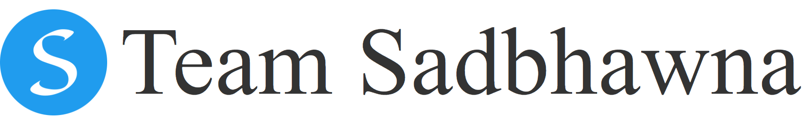

# Sadbhawna Website's Repository

</img>
## Action speaks louder than words - [Website](https://sadbhawna.onrender.com/)
### A portal where recovered COVID-19 patients can share their resources.

  Making a donation is the ultimate sign of solidarity. So here we are Team Sadbhawna launching our Web-Portal SADBHAWNA where recovered COVID-19 patients can donate any     medicines, supplements etc. can be helpful to others in need.

We make a heartful request for everyone to please come forward and contribute here. Your contribution in a small way may help many in their battle against COVID-19.

#### Note - Please consult a doctor before using any shared resource(s). Team Sadbhawna won't take any responsibilty as the portal is open for all.

## The Architecture 

### Our Team
| [Salokya Kumar](https://github.com/ksalokya)        | [Tisha Soumya](https://github.com/Tishasoumya-02) | [Sayan Bhattacharyya](https://github.com/Sayan3990) |
| ----------- | ----------- | ----------- |

## Thanks to all the contributors ❤️

#### Leave a star behind if this repo helped you in any way. 😄
